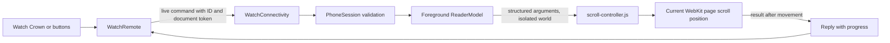

# Architecture

## One reader, two apps

The iPhone reader stays in the foreground. The watch sends small Codable
messages using `sendMessageData`; no background user-info queue is used. The
phone validates size, version, timestamp, numeric range, duplicate IDs, and
document identity before allowing a gesture. It also requires the reader to
be active with a loaded document.

`ReaderModel` injects the bundled engine into `WKContentWorld.defaultClient`
for the main frame only. Calls use named arguments, not string interpolation.
No web-to-native message handler is exposed. No URLs arrive from the watch.

The scroll engine chooses a focused nested scroller, then a remembered touched
scroller, then the document. It reports the actual position after an instant
scroll. WebKit integration has not yet been exercised; Chromium tests establish
only the DOM behavior.

## Command lifecycle

- At most one watch request is in flight; Crown deltas coalesce for 60 ms.
- Replies must match the current request UUID. Late replies are ignored.
- The watch abandons a request after 1.5 seconds, clears pending movement, and
  marks the connection unavailable. It does not retry gestures.
- The phone rejects commands more than 3 seconds in either direction from its
  clock. Paired device clocks need to be synchronized. Expiry is bounded, not
  remote cancellation: an already delivered command may execute before expiry
  even if its reply was lost.
- Navigation gives the reader a new document UUID. Old-page commands fail.
- A foreground watch heartbeat checks readiness every 2 seconds. Scene exit
  clears readiness and pending input; reconnects only ask for current state.
- No workout, audio, or extended runtime session is created. The OS may suspend
  the watch app. Wrist-down use is a required experiment, not a shipped promise.

## Boundaries and later adapters

This avoids system-wide touch injection. A Safari extension could share the
command model but needs a different iPhone delivery adapter: Apple's iOS
containing app cannot directly push messages to extension JavaScript. A pull
mechanism and its timing would need separate tests. Arbitrary native app
control is not part of this architecture.

Sources used for the design:

- [WatchConnectivity](https://developer.apple.com/documentation/watchconnectivity/wcsession)
- [Real-device lifecycle differences](https://developer.apple.com/documentation/watchconnectivity/transferring-data-with-watch-connectivity)
- [WKWebView](https://developer.apple.com/documentation/webkit/wkwebview)
- [Safari extension communication](https://developer.apple.com/documentation/safariservices/messaging-between-the-app-and-javascript-in-a-safari-web-extension)
